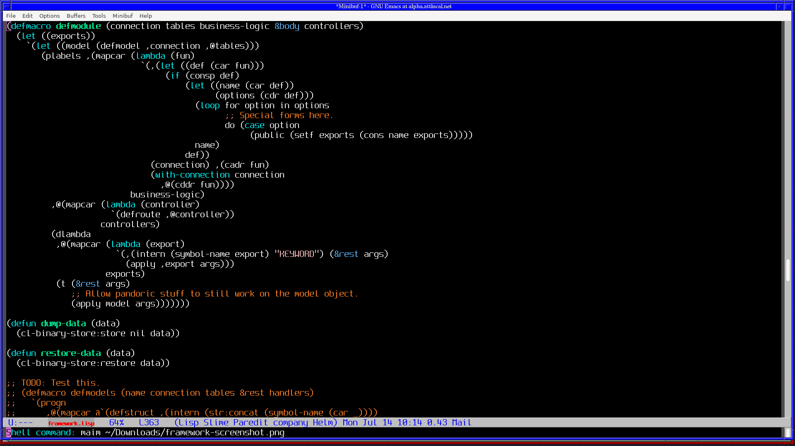
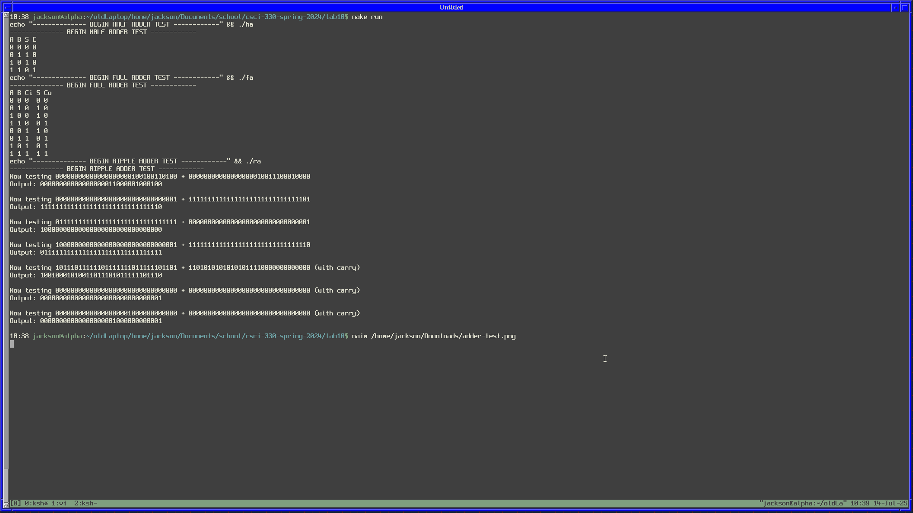
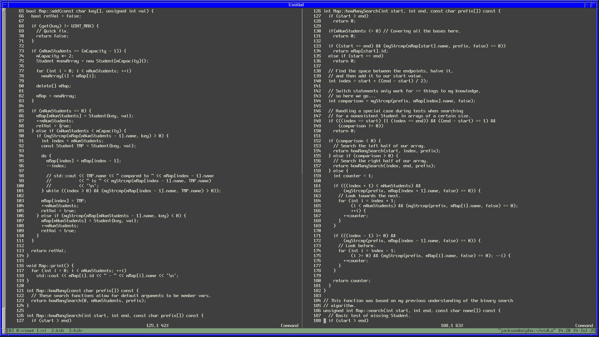

Portfolio
=========

Programming Projects
--------------------

*For access to my private project repositories, please [email me](mailto:pjlink@csustudent.net?subject=GitHub%20Access) with the subject line, GitHub Access.

---
### [Senior Project | CSCI 498](https://hub.darcs.net/pjlink/Senior-Project)

In Progress. Private Repo.

---
### [Verilog Build Step | CSCI 315](https://github.com/flashcardsmobile-admin/verilog-build-step-csci-330)

Build step I had to engineer for a verilog program since I was not aware that verilog had loops and did not want to look up the answer.

---
### [Inventive Map Implementation | CSCI 325](https://github.com/flashcardsmobile-admin/map-implementation)

A map implementation in Data Structures that doesn't use trees or hash tables.

---
### [Project 4 Title | CSCI 332](project1)

---

Ethics Papers
-------------

### [Paper 1 Title](/pdf/sample_presentation.pdf)

-   **Class:**  
-   **Grade:**

### [Paper 2 Title](/pdf/sample_presentation.pdf)

-   **Class:** 
-   **Grade:**

### [Paper 3 Title](/pdf/sample_presentation.pdf)

-   **Class:** 
-   **Grade:**

---

Presentations
-------------

### [Presentation 1 Title](/pdf/sample_presentation.pdf)

- **Class:** 
- **Grade:**

### [Presentation 2 Title](/pdf/sample_presentation.pdf)

- **Class:** 
- **Grade:**

---

Page template forked from <a href="https://github.com/csu-cs/csci-portfolio">CSU-CS</a>

<!-- Remove above link if you don't want to attributive -->
